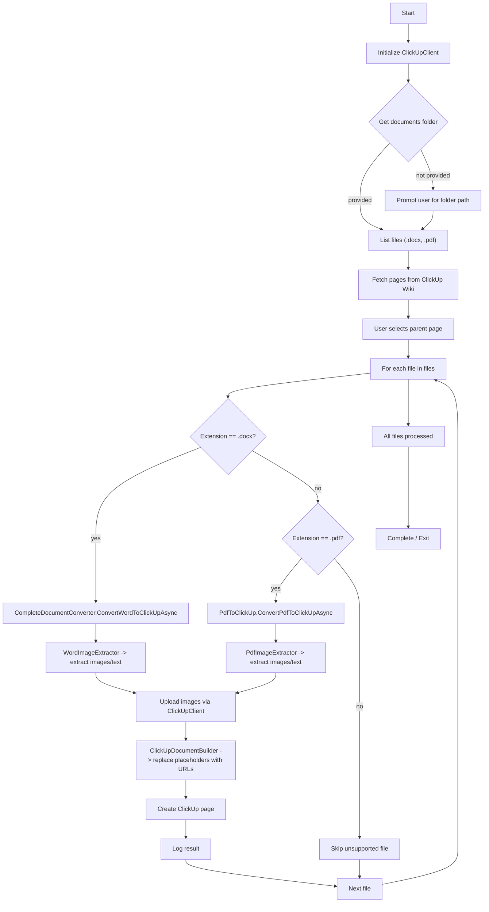
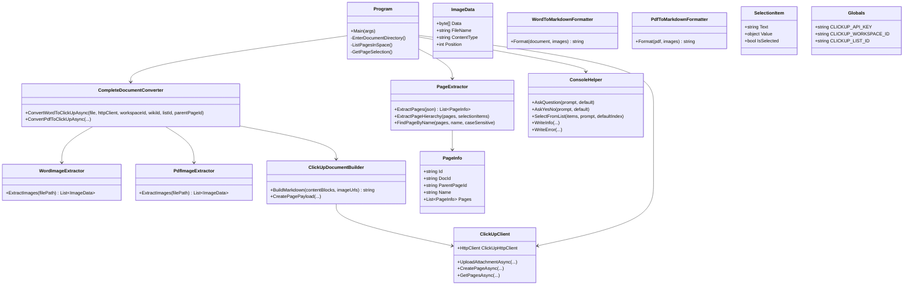

# ClickUpDocumentImporter

ClickUpDocumentImporter is a .NET 8 console utility that converts Word (.docx) and PDF documents into ClickUp pages. It extracts images and text, uploads images to ClickUp via the ClickUp attachment API, preserves image placement in the document, and builds markdown content to create ClickUp pages (optionally nested under a selected parent page).

This README documents the project, explains usage and configuration, and includes a program flowchart and class diagram for quick architectural orientation.

---

## Key features

- Convert Word (.docx) and PDF documents into ClickUp pages.
- Extract and upload embedded images to ClickUp; replace placeholders with ClickUp-hosted URLs.
- Maintain image position within document text.
- Preserve common text structures: headings, paragraphs, and tables (as markdown where applicable).
- Batch import entire folders of documents.
- Select target parent Wiki page interactively from ClickUp space.

---

## Prerequisites

- .NET 8 SDK
- Visual Studio 2022 (optional) or any editor/CLI for .NET 8 projects
- ClickUp API token and workspace/list/wiki IDs
- Required NuGet packages:
  - DocumentFormat.OpenXml
  - itext (or the PDF library referenced in the codebase)
  - System.Text.Json

Set ClickUp credentials and IDs in the project's `Helpers/Globals.cs` (or provide an equivalent configuration mechanism).

---

## Installation

1. Clone repository:
   - git clone https://github.com/mrogers0104/Epicor-ClickUpDocumentImporter

2. Restore packages:
   - dotnet restore

3. Build:
   - dotnet build

4. Run:
   - dotnet run -- <documentsFolder>
   - In Visual Studio use __Debug > Start Debugging__ or press F5.

---

## Configuration

Primary configuration values are held in `Helpers/Globals.cs`:
- CLICKUP_API_KEY
- CLICKUP_WORKSPACE_ID
- CLICKUP_LIST_ID

Program.cs also references constants for SPACE_ID, WIKI_ID and parent page defaults; these can be overridden at runtime when selecting the parent page.

Environment or secure secret storage is recommended for the API key.

---

## Usage

1. Place Word (.docx) and/or PDF files in a folder.
2. Run the application and provide the folder path when prompted (or use the default configured path).
3. The tool lists pages in the configured ClickUp Wiki; choose the parent page under which to create new pages.
4. The tool converts each file, uploads images, replaces placeholders with uploaded URLs, and creates ClickUp pages.

Example CLI:

`dotnet run -- "C:\temp\CustomizedScreenLogic"`

---

## High-level architecture and responsibilities

- Program.cs
  - Orchestrates the import process: directory input, ClickUp client initialization, page selection, iterates files.
- DocumentConverter
  - CompleteDocumentConverter: high-level conversion entry points for Word and PDF.
  - WordToMarkdownFormatter / PdfToMarkdownFormatter: convert document structures to markdown blocks.
  - WordImageExtractor / PdfImageExtractor: locate and extract images and metadata.
  - PdfToClickUp / PdfToMarkdownFormatter: PDF-specific conversion details.
  - ImageData / FormattedTextBlock / FormattedTextExtractionStrategy: helpers for extraction and intermediate representation.
- Helpers
  - ClickUpClient: wraps ClickUp HTTP calls, sets headers and rate-limit handling.
  - ClickUpDocumentBuilder: builds final markdown payloads and attachments for ClickUp pages.
  - PageExtractor: lists and navigates wiki/page hierarchy to allow parent page selection.
  - ConsoleHelper: console UI interactions and prompts.
  - Globals: configuration container for API keys and IDs.

---

## Program flowchart

The following mermaid flowchart shows the runtime flow from startup to import completion.

---

## Class diagram

Mermaid class diagram of the most important types and relationships:

---

## API & implementation notes

- ClickUp authentication
  - ClickUp API token is passed in the HTTP Authorization header via ClickUpClient.
- Rate limiting
  - Uploading many images may hit ClickUp rate limits. Implement exponential backoff or throttling in ClickUpClient.UploadAttachmentAsync.
- Image formats
  - Some PDF-embedded images may require conversion to PNG/JPEG before upload. The PDF extractor should expose raw bytes plus a content type.
- Markdown generation
  - The formatters attempt to maintain structure (headers, lists, tables). Complex formats may require manual review after import.

---

## Troubleshooting

- "Directory does not exist" — verify path and permissions.
- ClickUp 401/403 — confirm CLICKUP_API_KEY is valid and has required scopes.
- Missing images in PDF — some PDFs store images as XObjects or with uncommon encodings. Inspect extracted ImageData content type and convert if needed.
- Logging — the console helper prints status and errors. Check the output for upload/create errors.